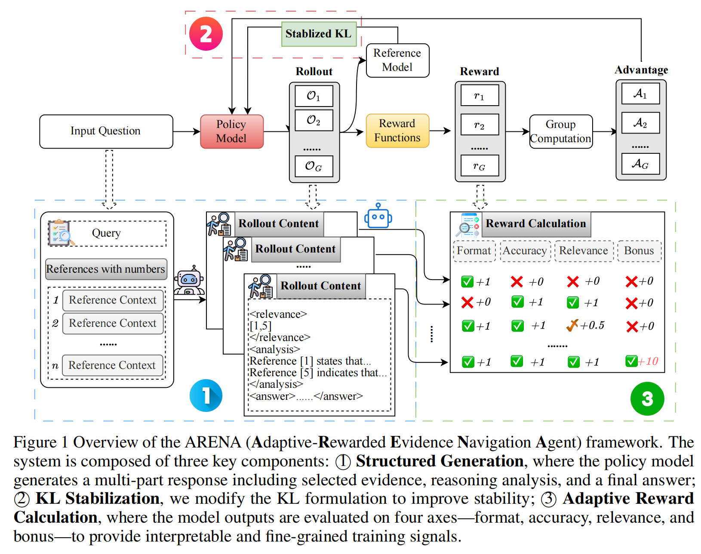

# ARENA

## Overview

Retrieval-Augmented Generation (RAG) has significantly improved the performance of large language models (LLMs) on knowledge-intensive domains. However, although RAG has achieved success across distinct domains, there remain two key unsolved challenges:

1. **Effectiveness**: Most existing research focuses on developing more powerful retrievers. However, how to enhance the generator's (LLM’s) ability to utilize retrieved information for reasoning and generation remains underexplored.
2. **Transparency**: Many RAG methods overlook which retrieved content actually contributes to the reasoning process, leading to poor interpretability and decision traceability.

To address these issues, we propose **ARENA** (**A**daptive-**R**ewarded **E**vidence **N**avigation **A**gent), a transparent RAG generator framework trained via reinforcement learning (RL) with our proposed adaptive rewards. ARENA enables:

- **Structured Generation**: Organizing answers around reasoning steps.
- **Adaptive Rewarding**: Reinforcement learning based on both correctness and decision traceability.

Extensive experiments on multi-hop QA datasets using **Qwen2.5-7B-Instruct** and **Llama3.1-8B-Instruct** show that ARENA outperforms existing RAG baselines by **10–30%**, and is comparable to state-of-the-art commercial models like **OpenAI-o1** and **DeepSeek-R1**. ARENA also demonstrates strong flexibility and generalizability across datasets.

📄 Want to learn more? Please refer to our paper:  
**[ARENA: Adaptive-Rewarded Evidence Navigation Agent](https://arxiv.org/pdf/2505.13258)**

🧠 Check out our released models:  
- [ARENA-Qwen-7B](https://huggingface.co/ren258/ARENA-Qwen-7B)  
- [ARENA-Llama-8B](https://huggingface.co/ren258/ARENA-Llama-8B)

---

📷 *Overview illustration here:*  
*(Please insert the screenshot from your paper below this line)*



## Usage

We recommend using a clean Conda environment. Our experiments were conducted with **Python 3.11**, **CUDA 12.4**, and **8 NVIDIA A100-80GB GPUs**.

### Create Conda Environment

```bash
conda create -n ARENA python=3.11
conda activate ARENA
```

### Install Dependencies

All scripts are provided in the `scripts/` folder.

Run the following script to install required dependencies:

```bash
bash scripts/install_environment.sh
```

This script does the following:

```bash
cd ..
pip install -r requirements.txt
cd trl
pip install -e .

pip install flash-attn --no-build-isolation

cd ../open-r1
pip install -e ".[dev]"
```

> **Note**:
> - We use and **modify the following open-source repositories** in our codebase:
>   - [PIKE-RAG (MIT License)](https://github.com/microsoft/PIKE-RAG)
>   - [TRL (Apache-2.0)](https://github.com/huggingface/trl)
>   - [Open-R1 (Apache-2.0)](https://github.com/huggingface/open-r1)
> - Modified versions of these libraries are included in our repository and installed from source.
> - If installing `flash-attn` fails, please manually download and install the correct version from:
>   [https://github.com/Dao-AILab/flash-attention/releases](https://github.com/Dao-AILab/flash-attention/releases)
>
> ⚠️ **Important**:  
> We recommend setting up your environment using the exact versions and procedures we provide.  
> Using different package versions or environments may lead to unexpected issues or failure to run the code properly.

---

### Download Datasets

Run the following script to download the three multi-hop QA datasets used in our experiments:

```bash
bash scripts/download_data.sh
```

This internally runs:

```bash
python ../pikerag/main.py ../pikerag/data_process/config/datasets.yaml
```

We have modified PIKE-RAG's data downloader to correctly handle:
- **HotpotQA**
- **2WikiMultiHopQA**
- **MuSiQue**

---

### Download Base Models

Run the following script to download the base LLMs. For example:

```bash
bash scripts/download_model.sh
```

This script uses [ModelScope](https://modelscope.cn) to download Qwen:

```bash
modelscope download --model Qwen/Qwen2.5-7B-Instruct --local_dir ../model/Qwen2.5-7B-Instruct
```

---

### Preprocess Data

Run the following script to preprocess data for training:

```bash
bash scripts/run_data_processing.sh
```

This will process all datasets into the format required by our **GRPO** training setup:

```bash
# Inside run_data_processing.sh

names=("hotpotqa" "two_wiki" "musique")
train_limits=(10000 10000 5000)
test_limit=500

for i in "${!names[@]}"; do
  name=${names[$i]}
  train_limit=${train_limits[$i]}
  
  echo "Running data processing for $name..."
  python ../src/data_generator.py --name "$name" --train-limit "$train_limit" --test-limit "$test_limit"
  python ../src/datamaker_conversation.py --name "$name" --testfile-name "test"
done

python ../src/datamaker_grpo.py --name "hotpotqa" "two_wiki" "musique" --trainfile-name "train" --saved-name "grpo_25000"
```

---

### Train with GRPO

Run the following script to start training with our GRPO framework:

```bash
bash scripts/run_grpo.sh
```

The core command:

```bash
ACCELERATE_LOG_LEVEL=info accelerate launch --config_file ../configs/deepspeed_zero2.yaml \
    --num_processes=7 ../src/grpo.py \
    --config ../configs/grpo.yaml
```

We use **DeepSpeed Zero2** for efficient multi-GPU training.

---

### Inference

All inference and evaluation results are provided in the `results/` folder.

To perform inference on the test set using the base model (before training), we use the vLLM engine.

Run the following script:

```bash
bash scripts/run_inference.sh
```

This internally calls:

```bash
python ../src/vllm_inference.py \
  --name "hotpotqa" \
  --testdata-name "test" \
  --saved-name "test_base_500" \
  --model-path "../model/Qwen2.5-7B-Instruct"
```

---

### Evaluation

All inference and evaluation results are provided in the `results/` folder.

You can evaluate the inference results using either rule-based metrics or LLM-as-a-judge (LJ):

#### Rule-based Evaluation (EM / F1)

```bash
bash scripts/run_evaluate_rulebase.sh
```

This runs:

```bash
python ../src/evaluate.py \
  --name "hotpotqa" \
  --result-name "test_base_500"
```

#### LLM-as-a-Judge Evaluation (LJ)

```bash
bash scripts/run_evaluate_gpt.sh
```

This runs:

```bash
python ../src/gpt_eval.py \
  --name "hotpotqa" \
  --result-name "test_base_500"
```

> **Note**:  
> For `gpt_eval.py`, make sure you have set your OpenAI API key via the `OPENAI_API_KEY` environment variable.

---

### Train with SFT

We also provide code for reproducing the supervised fine-tuning (SFT) method described in our paper.

#### Step 1: Prepare SFT Data

```bash
bash scripts/run_sft_prepare.sh
```

This script includes the following steps:

```bash
# For each dataset
names=("hotpotqa" "two_wiki" "musique")
train_limits=(10000 10000 5000)
test_limit=500

for i in "${!names[@]}"; do
  name=${names[$i]}
  train_limit=${train_limits[$i]}
  
  echo "Running sft preparation for $name..."
  python ../src/data_generator_sft.py --name "$name" --train-limit "$train_limit" --test-limit "$test_limit"
  python ../src/vllm_inference_sft.py --name "$name" --testdata-name "train_sft_first_step" --saved-name "train_sft_first_step" --model-path "../model/Qwen2.5-7B-Instruct"
done

# Merge into final training file
python ../src/datamaker_sft.py --name "hotpotqa" "two_wiki" "musique" --trainfile-name "train_sft_first_step" --saved-name "sft_25000"
```

#### Step 2: Run SFT Training

```bash
bash scripts/run_sft.sh
```

This launches supervised fine-tuning with DeepSpeed Zero2:

```bash
accelerate launch \
  --config_file ../configs/deepspeed_zero2.yaml \
  ../src/sft.py \
  --model_name_or_path ../model/Qwen2.5-7B-Instruct \
  --dataset_name ../data/data_train/sft/sft_25000.jsonl \
  --per_device_train_batch_size 4 \
  --output_dir ../checkpoints/Qwen2.5-7B-Instruct-SFT_25000 \
  --bf16 True \
  --gradient_accumulation_steps 8 \
  --num_train_epochs 1 \
  --logging_steps 1 \
  --eval_strategy steps \
  --eval_steps 100 \
  --learning_rate 1e-5 \
  --max_grad_norm 0.3 \
  --warmup_ratio 0.1 \
  --torch_dtype bfloat16 \
  --gradient_checkpointing True
```

#### Step 3: Evaluate SFT Model

You can evaluate the trained SFT model using the same evaluation scripts as GRPO models (see previous Evaluation section).

---

## Citation

If you find our work helpful, please consider citing our paper:

```bibtex
@article{ren2025effective,
  title={Effective and Transparent RAG: Adaptive-Reward Reinforcement Learning for Decision Traceability},
  author={Ren, Jingyi and Xu, Yekun and Wang, Xiaolong and Li, Weitao and Ma, Weizhi and Liu, Yang},
  journal={arXiv preprint arXiv:2505.13258},
  year={2025}
}
```

---

## License

This project is licensed under the [MIT License](https://github.com/ren258/ARENA/blob/main/LICENSE).
